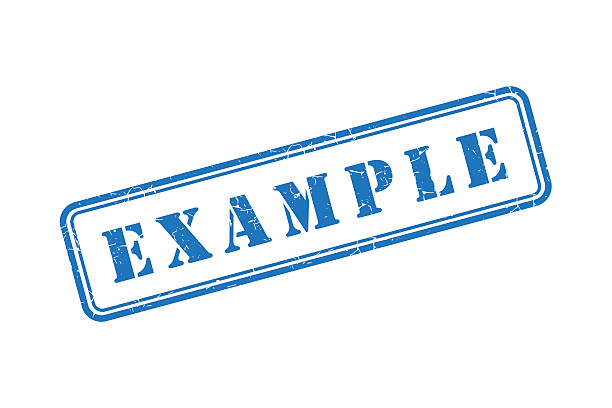

<!-- ===== DANGER ZONE: DON'T TOUCH IT ======-->
id: codelab-deployment
status: Published
<!-- ======================================= -->

summary: Plantilla para crear Codelabs
authors: Autores, Separados, Por, Comas
categories: Categorías, Separadas, Por, Comas

# Titulo del Codelab

<!-- ------------------------ -->
## Titulo de la sección 
<!-- Duración de esta sección, en formato hh:mm:ss  -->
Duration: 00:15:00 

### Subtitulo

#### Subtitulo 2

**Listas**

- how to set the amount of time each slide will take to finish 
- how to include code snippets 
- how to hyperlink items 
- how to include images 
- other stuff


**Bloques de código**

```js
console.log("Este es un bloque de código");
```

**Enlaces**

[Youtube](https://www.youtube.com/watch?v=dQw4w9WgXcQ)

**Imágenes**



**Tablas**

| Columna 1 | Columna 2 |
|-----------|-----------|
| Valor 1   | Valor 2   | 

**Notas**

> aside negative
> ⚠️ Esta es una nota de advertencia o de información importante.
> Puedes incluir varias líneas de texto en una nota.
> También puedes incluir código:
> ```js
> console.log("Este es un bloque de código");
> ```
> O puedes incluir cualquier otro tipo de contenido en formato Markdown.

> aside positive
> ✅ Esta es una nota positiva.
> Puedes usarla para resaltar información importante o útil.
> De igual forma puedes incluir varias líneas de texto.
> También puedes incluir enlaces, imágenes o cualquier otro tipo de contenido en formato `Markdown`.

<!-- ------------------------ -->
## Segunda página
Duration: 00:5:00

### Subtitulo en otra página

Acá puedes incluir más contenido, como texto, imágenes, enlaces, etc.